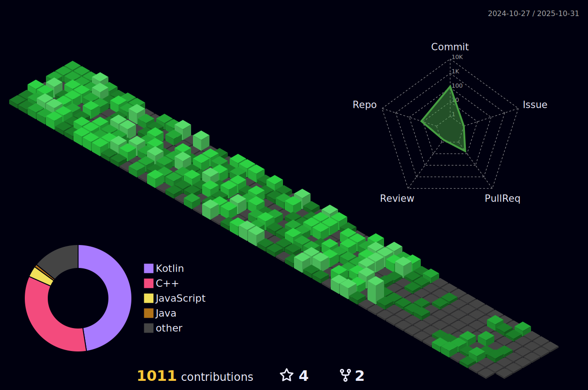

# 🌟 **Suray Marag Pandit**

> *Android Developer | Software Engineer | Problem Solver*

I’m an **inquisitive and motivated developer** passionate about **building impactful, user-focused mobile applications**.
With a strong foundation in **Kotlin, Jetpack Compose, and Clean Architecture**, I strive to create **scalable, high-quality apps** that make a real-world impact.

* 🛠️ **Currently Working On:** Advanced Android apps with Jetpack Compose + MVVM + Clean Architecture
* 🤝 **Looking to Collaborate With:** Tech-savvy developers and teams solving meaningful problems
* 📚 **Currently Learning:** Backend development with **Ktor**, **SQLDelight**, and **Firebase optimizations**
* 🏆 **Recent Achievement:** Built a full-featured chat app with real-time updates and scalable architecture
* 🎉 **Fun Fact:** I can spend hours perfecting UI animations and micro-interactions ✨

---

## 🌐 **Connect With Me**

  
  
  
  
  

---

## 💻 **Tech Stack**

### **Languages**

  
  
  
  
  
  

### **Android Development**

  
  
  
  
  
  
  

### **Tools & Platforms**

  
  
  
  
  
  
  

---

## 📊 **GitHub Stats**

  

  
  

---

## 🏆 **Achievements**

  

---

## ✨ **Why Work With Me**

* 💡 Strong foundation in **Android development** and modern app architecture
* ⚡ Experience in building **real-world scalable apps** from scratch
* 🤝 Team player with **excellent collaboration skills**
* 🌱 Always learning and **staying up-to-date** with new technologies

> *"The best way to predict the future is to create it." – Alan Kay*

---
